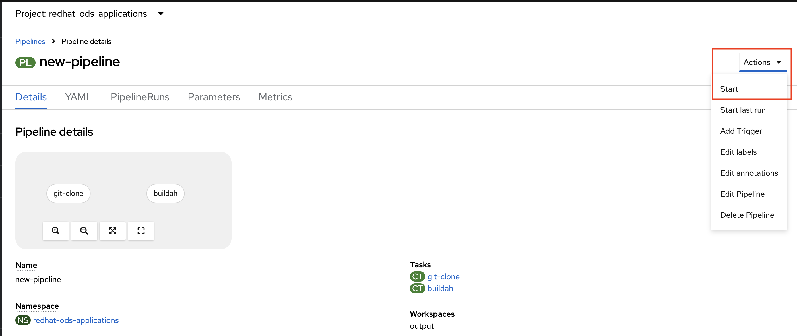
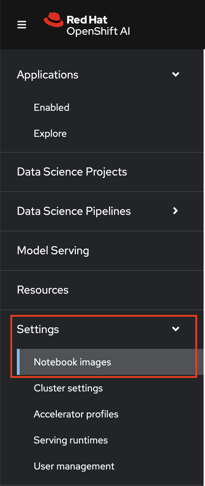
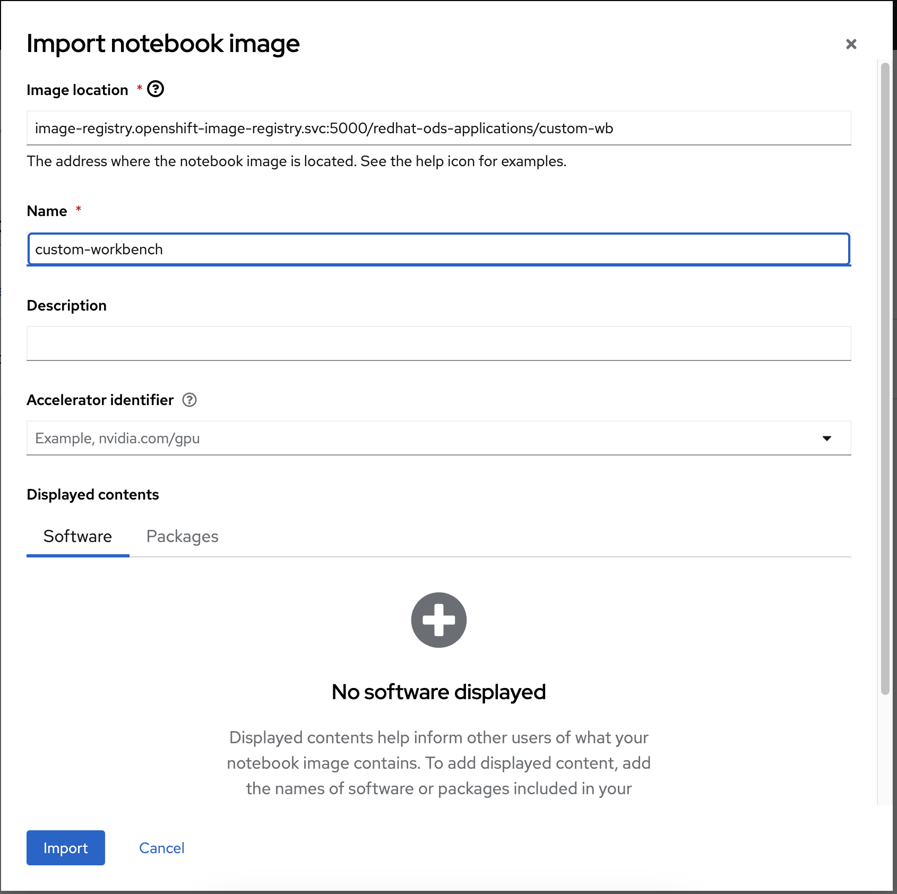
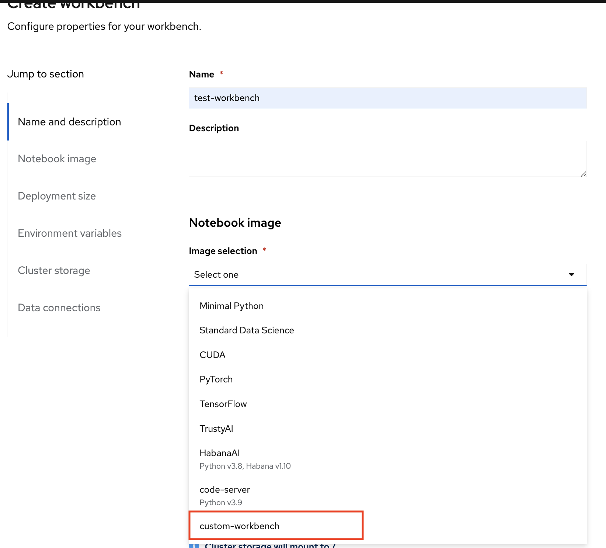

Create a Custom Workbench for RHOAI

The Dockerfile uses an existing workbench image and installs new packages from the requirements.txt file.
The Openshift Tekton pipeline has two tasks: git-clone and buildah
The first task git clones this repository so we can use the Dockerfile and the requirements.txt.
The second task uses buildah to build the Dockerfile (in this folder and uses the requirements.txt file) and pushes the container image to the openshift registry.

Enable openshift image registry so we can push custom notebook image to openshift image registry.
1. Expose openshift image registry route.
`oc patch configs.imageregistry.operator.openshift.io/cluster --patch '{"spec":{"defaultRoute":true}}' --type=merge`

2. Get route:
`oc get route -n openshift-image-registry`

3. Change namespace:
`oc project redhat-ods-applications`

4. Create PVC for pipeline:
`oc apply -f pvc.yaml `

5. Change url to image registry url in buildah task in `pipeline.yaml`.

6. Apply pipeline.yaml and run pipeline. 

Choose newly created PVC for pipeline.

7. Go into RHOAI dashboard.
8. Settings > Notebook Images > Import new image > Image location

Enter image location. In Openshift > Builds > ImageStreams > custom-wb, we can get the location:
`image-registry.openshift-image-registry.svc:5000/redhat-ods-applications/custom-wb`

9. Create data science project.

10. Create workbench and choose your new custom notebook.

11. Launch workbench

